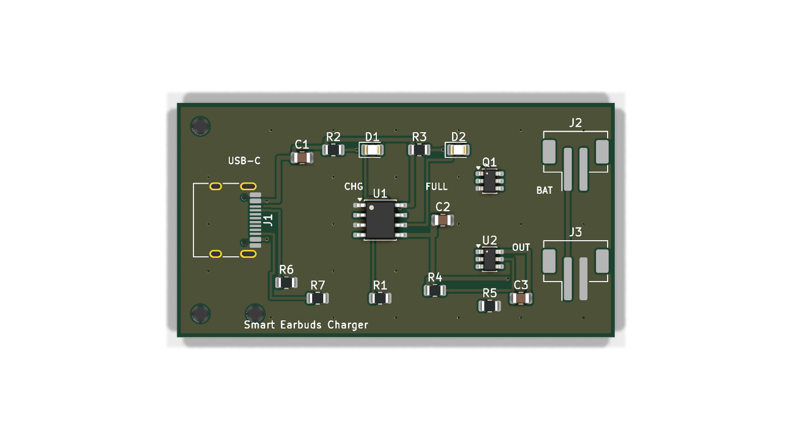

# Smart Earbuds Charging PCB

A compact 2‑layer PCB that manages charging, protection and power delivery for
the rechargeable battery inside a wireless‑earbuds charging case. It takes 5 V
from a USB Type‑C input, charges a single‑cell 3.7 V Li‑ion battery with a
TP4056, protects the cell with a DW01A + dual‑MOSFET circuit, and shows charge
status on two LEDs.

Designed in **KiCad 10**. Schematic (ERC) and layout (DRC) are both **clean –
0 errors, 0 warnings, 0 unconnected nets.**



---

## 1. Project purpose

| Requirement | How it is met |
|---|---|
| Charge a single‑cell 3.7 V Li‑ion battery | TP4056 linear Li‑ion charger (4.2 V CC/CV) |
| USB‑C input for charging | 16‑pin USB‑C receptacle with CC pull‑downs |
| Overcharge / over‑discharge protection | DW01A protection IC + FS8205A dual N‑MOSFET |
| Charging status indicators | Red LED = charging, Green LED = fully charged |
| Power & ground labels | `+5V`, `+BATT`, `BATT-`, `GND` nets / power symbols |
| Compact, earbuds‑case friendly | 56 × 30 mm, 2‑layer, all SMD |

---

## 2. Components used

| Ref | Part | Footprint | Value / Notes |
|-----|------|-----------|---------------|
| J1 | USB‑C receptacle (USB 2.0, power) | `USB_C_Receptacle_HRO_TYPE-C-31-M-12` | 5 V power input, edge‑mounted |
| U1 | **TP4056** Li‑ion charger | SOIC‑8 | Standalone 4.2 V linear charger |
| U2 | **DW01A** protection IC | SOT‑23‑6 | 1‑cell over‑charge/discharge/current |
| Q1 | **FS8205A** dual N‑MOSFET | SOT‑23‑6 | Back‑to‑back protection switch |
| D1 | LED – **Red** | 0805 | Charging indicator (CHRG) |
| D2 | LED – **Green** | 0805 | Full / standby indicator (STDBY) |
| R1 | 2 kΩ | 0805 | TP4056 `PROG` → ≈ 580 mA charge current |
| R2 | 1 kΩ | 0805 | Red‑LED series resistor |
| R3 | 1 kΩ | 0805 | Green‑LED series resistor |
| R4 | 100 Ω | 0805 | DW01A VDD decoupling resistor |
| R5 | 2 kΩ | 0805 | DW01A `CS` sense resistor |
| R6 | 5.1 kΩ | 0805 | USB‑C `CC1` pull‑down (Rd) |
| R7 | 5.1 kΩ | 0805 | USB‑C `CC2` pull‑down (Rd) |
| C1 | 10 µF | 0805 | VBUS input decoupling |
| C2 | 10 µF | 0805 | Battery / output decoupling |
| C3 | 100 nF | 0805 | DW01A VDD decoupling |
| J2 | Battery connector | JST‑PH 2‑pin SMD | `+BATT` / `BATT-` to the Li‑ion cell |
| J3 | Output connector | JST‑PH 2‑pin SMD | Protected `+BATT` / `GND` to the earbuds |
| H1–H3 | Mounting holes | M2 (2.2 mm) | Mechanical fixing |

All component values follow the TP4056 and DW01A manufacturer reference designs.

### Why these values
* **R1 = 2 kΩ (PROG):** charge current `I = 1200 / R_PROG(kΩ) ≈ 580 mA`, a safe
  ~0.5–1 C rate for the small (typ. 300–800 mAh) cells used in earbuds cases.
  Swap to 1.2 kΩ for 1 A or 5 kΩ for ~240 mA.
* **R6 / R7 = 5.1 kΩ:** the USB‑C spec Rd pull‑downs that tell a USB‑C source
  the board is a sink so it enables 5 V VBUS.
* **R2 / R3 = 1 kΩ:** ≈ 3 mA LED current from the 5 V rail.
* **R4 = 100 Ω + C3 = 100 nF:** DW01A supply RC filter (datasheet typical).

---

## 3. Architecture / signal flow

```
 USB-C 5V ──► TP4056 (charger) ──► +BATT ──┬──► Battery + (J2)
                                            └──► Output + (J3, to earbuds)
 Battery - (B-) ──► FS8205A protection FETs ──► GND (P-) ──► TP4056 / USB return
                         ▲
                       DW01A  (monitors cell voltage & current)
```

* `+5V`  – USB VBUS rail (TP4056 VCC + CE, LEDs, input cap).
* `+BATT`– battery positive = charger output = protected output positive.
* `BATT-`– battery negative (the *protected* node, only the cell + FETs + DW01A GND).
* `GND`  – system / pack‑negative return (USB, TP4056, output −), poured on both layers.

The two protection MOSFETs sit **in the battery's negative return path**, so the
DW01A can interrupt both charge and discharge current.

---

## 4. Charging workflow

1. A USB‑C cable applies **5 V (VBUS)** to the board. `R6`/`R7` (5.1 kΩ on CC1/CC2)
   present the board as a sink, so the source keeps VBUS enabled.
2. **TP4056** charges the cell with a constant‑current / constant‑voltage profile
   up to **4.2 V**. The constant‑current value (~580 mA) is set by `R1` on `PROG`.
   `CE` is tied high (`+5V`) to keep the charger enabled; `TEMP` is tied to `GND`
   (NTC thermistor sensing disabled).
3. While charging, the open‑drain **`CHRG`** output pulls low → **red LED (D1)**
   is on through `R2`.
4. When the cell reaches 4.2 V and the current tapers to ~1/10 of the set value,
   charging stops, **`STDBY`** pulls low → **green LED (D2)** turns on and the red
   LED turns off.
5. `C1` (input) and `C2` (battery side) provide local decoupling per the TP4056
   datasheet.

---

## 5. Battery‑protection workflow

The **DW01A + FS8205A** form a standard 1‑cell protection circuit:

* The DW01A measures the cell voltage across `VDD–VSS` (powered from `+BATT`
  through `R4`, decoupled by `C3`) and the current through the FETs via `CS`
  (referenced to the pack negative `GND` through `R5`).
* The **FS8205A** holds two N‑channel MOSFETs in series (common drain) between the
  cell negative (`BATT-`) and the pack negative (`GND`). One FET gates **charge**
  (`OC`), the other gates **discharge** (`OD`).

| Event | DW01A action | Result |
|---|---|---|
| **Over‑charge** (cell > ~4.3 V) | turns off the charge FET via `OC` | stops further charging |
| **Over‑discharge** (cell < ~2.4 V) | turns off the discharge FET via `OD` | disconnects the load, prevents deep discharge |
| **Over‑current / short** (high V across FETs at `CS`) | turns off both FETs | cuts current, auto‑recovers when fault clears |

Because the FETs are in the common ground return, the protection works for both
the charge path (USB → cell) and the discharge path (cell → earbuds output J3).

---

## 6. Board / layout details

| Spec | Value |
|---|---|
| Size | **56 × 30 mm** (compact, fits a charging‑case base) |
| Layers | **2** (F.Cu + B.Cu) |
| Copper | GND **pour on both layers**, stitched with vias |
| Power traces | **0.5 mm** (`+5V`, `+BATT`, `BATT-`, `GND` → *Power* net class) |
| Signal traces | **0.3 mm** |
| Clearance | 0.2 mm | 
| Vias | 0.6 mm / 0.3 mm drill |
| USB‑C | on the **left board edge**, opening facing off‑board |
| Connectors | battery (J2) and output (J3) on the right edge |
| Mounting holes | 3 × M2 |

Good‑practice points applied: USB‑C on the board edge, wide low‑impedance power
traces, a continuous ground pour separating/return‑pathing the signals, signal
vs. power routing kept apart, and silkscreen labels (`USB‑C`, `CHG`, `FULL`,
`BAT`, `OUT`, board title).

---

## 7. Files

```
motherboard-design.kicad_pro   KiCad 10 project (Default + Power net classes)
motherboard-design.kicad_sch   Schematic
motherboard-design.kicad_pcb   PCB layout (routed, zones filled)
EarbudsCharger.kicad_sym       Project symbol library (TP4056, DW01A, FS8205A)
sym-lib-table                  Registers the project symbol library
README.md                      This document
docs/schematic.pdf             Schematic export
docs/pcb_top.png               3D render – top
docs/pcb_bottom.png            3D render – bottom
docs/erc_report.rpt            ERC result (0 violations)
docs/drc_report.rpt            DRC result (0 violations)
tools/gen_schematic.py         Reproducible schematic generator
tools/gen_pcb.py               Reproducible PCB generator + maze router
```

The three ICs (TP4056, DW01A, FS8205A) are not in the stock KiCad libraries, so
they are provided as a project symbol library (`EarbudsCharger.kicad_sym`) and are
also embedded in the schematic.

---

## 8. Verification

```
ERC : 0 errors, 0 warnings           (kicad-cli sch erc)
DRC : 0 violations, 0 unconnected     (kicad-cli pcb drc)
```

To re‑check:

```sh
kicad-cli sch erc  motherboard-design.kicad_sch
kicad-cli pcb drc  motherboard-design.kicad_pcb
```

---

## 9. Opening the project

Open `motherboard-design.kicad_pro` in **KiCad 10**.

> The board is fully routed with both ground planes filled. If you edit the
> layout, run **Edit → Fill All Zones (B)** and re‑run DRC.

### ⚠️ Note on regeneration
The PCB is built programmatically by `tools/gen_pcb.py` using the KiCad `pcbnew`
Python API; the schematic by `tools/gen_schematic.py`. Re‑running them recreates
the `.kicad_sch` / `.kicad_pcb` from scratch, so close the project in the KiCad
GUI before regenerating (an open GUI session can overwrite the generated files
when it saves).
